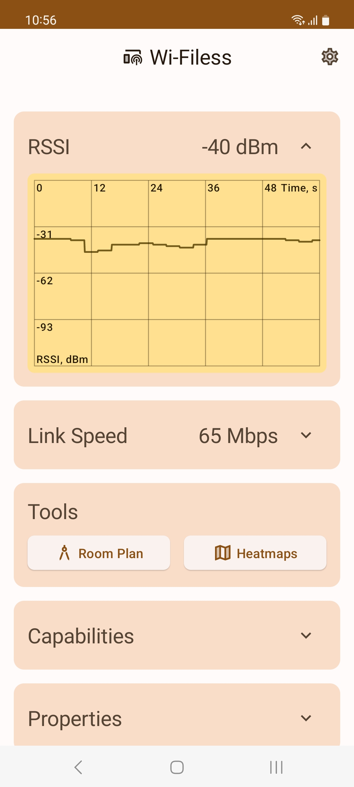
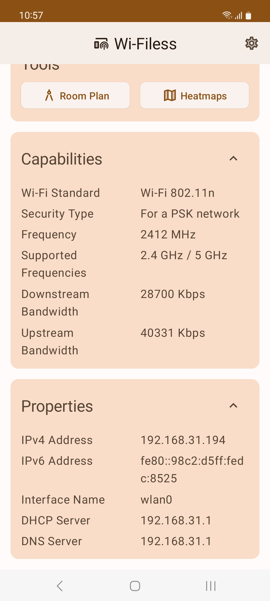
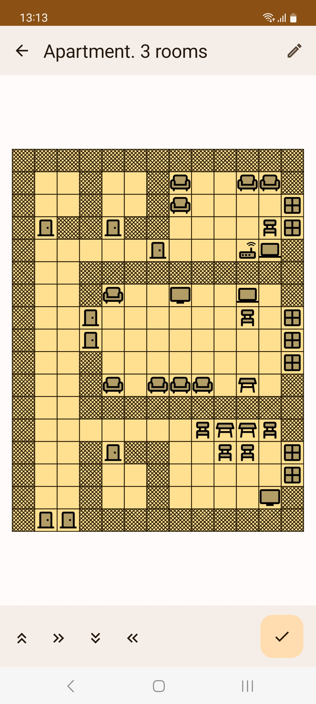
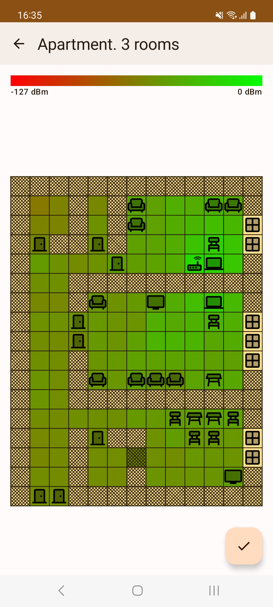
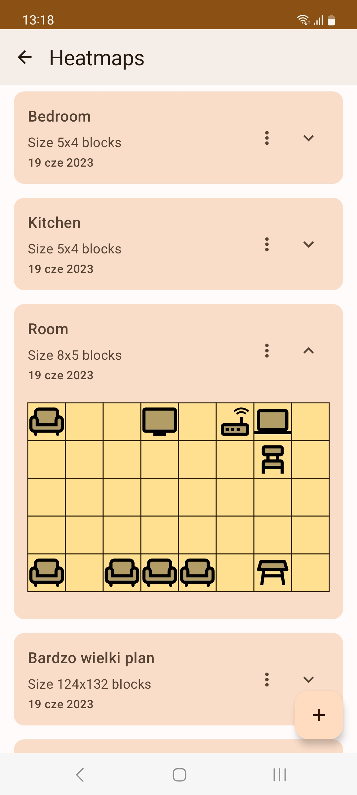

# Wi-Filess
Android app for assessing Wi-Fi signal quality

## Description
The Wi-Filess application is designed to evaluate the signal quality of Wi-Fi network based on the Received Signal Strength Indicator (RSSI).

The application includes a room plan editor and heat map functionality to identify areas of poor Wi-Fi coverage in a room.

Development was done in the Kotlin programming language using Jetpack libraries. The user interface was written using Compose. The application database is implemented by the Room library.

## How to get the app
I'm not currently distributing the app via app stores or apk files, but there is source code available if you want to build app yourself in Android Studio.

## Screenshots
Application start screen with information about RSSI and link speed.

Connection capabilities and properties are also on the start screen.

You can create and modify the plan in the editor.

After creating the plan, it's time to make a heat map!

All saved plans and heat maps can be found on the list screen.

